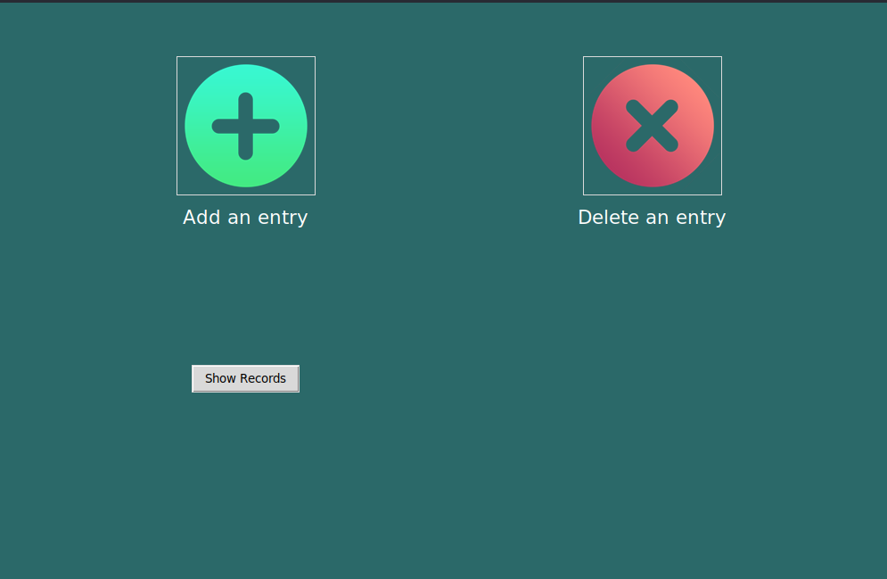

<!-- Improved compatibility of back to top link: See: https://github.com/othneildrew/Best-README-Template/pull/73 -->
<a name="readme-top"></a>
<!--
*** Thanks for checking out the Best-README-Template. If you have a suggestion
*** that would make this better, please fork the repo and create a pull request
*** or simply open an issue with the tag "enhancement".
*** Don't forget to give the project a star!
*** Thanks again! Now go create something AMAZING! :D
-->


<!-- PROJECT SHIELDS -->
<!--
*** I'm using markdown "reference style" links for readability.
*** Reference links are enclosed in brackets [ ] instead of parentheses ( ).
*** See the bottom of this document for the declaration of the reference variables
*** for contributors-url, forks-url, etc. This is an optional, concise syntax you may use.
*** https://www.markdownguide.org/basic-syntax/#reference-style-links
-->
[![Contributors][contributors-shield]][contributors-url]
[![Forks][forks-shield]][forks-url]
[![Stargazers][stars-shield]][stars-url]
[![Issues][issues-shield]][issues-url]
[![LinkedIn][linkedin-shield]][linkedin-url]


<!-- PROJECT LOGO -->
<br />
<div align="center">
  <a href="https://github.com/atom-robotics-lab/assets/blob/main/logo_1.png?raw=true">
    
  </a>

<h3 align="center">Lab Attendance Server</h3>

  <p align="center">
    This is the repo for the <a href="https://github.com/atom-robotics-lab/labserver">Lab Attendance Server</a> Project, Lab Attendance Server is autonomous IOT project made by A.T.O.M Robotics capable of doing multiple things like recording attendace through a tap of RFID card, managing the lights in the room and person detection.
    <br />
    <a href=""><strong>Demo video »</strong></a>
    <br />
    <br />
    <a href="https://github.com/atom-robotics-lab/MR-Robot/issues/new?labels=bug&assignees=Nalwa-Jayesh,Hriday31,atomroboticslab,namikxgithub">Report Bug</a>
    ·
    <a href="https://github.com/atom-robotics-lab/MR-Robot/issues/new?labels=enhancement&assignees=Nalwa-Jayesh,Hriday31,atomroboticslab,namikxgithub">Request Feature</a>
  </p>
</div>


<!-- TABLE OF CONTENTS -->
<details>
  <summary>Table of Contents</summary>
  <ol>
    <li>
      <a href="#about-the-project">About The Project</a>
      <ul>
        <li><a href="#built-with">Built With</a></li>
      </ul>
    </li>
    <li>
      <a href="#getting-started">Getting Started</a>
      <ul>
        <li><a href="#prerequisites">Prerequisites</a></li>
        <li><a href="#installation">Installation</a></li>
      </ul>
    </li>
    <li><a href="#usage">Usage</a></li>
    <li><a href="#roadmap">Roadmap</a></li>
    <li><a href="#contributing">Contributing</a></li>
    <li><a href="#contact">Contact</a></li>
    <li><a href="#acknowledgments">Acknowledgments</a></li>
  </ol>
</details>


<!-- ABOUT THE PROJECT -->
## About The Project

This is the repo for the <a href="https://github.com/atom-robotics-lab/labserver">Lab Attendance Server</a> Project, Lab Attendance Server is autonomous IOT project made by A.T.O.M Robotics capable of doing multiple things like recording attendace through a tap of RFID card, managing the lights in the room and person detection.  

<p align="right">(<a href="#readme-top">back to top</a>)</p>


### Built With

* [](https://docs.docker.com/get-started/)
* [](https://opencv.org/)
* [](https://flask.palletsprojects.com/en/2.3.x/)
* [](https://www.espressif.com/)
* [](https://www.arduino.cc/)
* [](https://ubuntu.com/)
* [](https://www.python.org/)

<p align="right">(<a href="#readme-top">back to top</a>)</p>


<!-- GETTING STARTED -->
## Getting Started
***

This is an example of how you may give instructions on setting up your project locally.
To get a local copy up and running follow these simple example steps.

### Prerequisites

This is an example of how to list things you need to use the software and how to install them.
* **Docker**
  - First, update your existing list of packages:
    ```sh
    sudo apt update
    ```
  - Next, install a few prerequisite packages which let apt use packages over HTTPS:
    ```sh 
    sudo apt install apt-transport-https ca-certificates curl software-properties-common
    ```
  - Then add the GPG key for the official Docker repository to your system:
    ```sh
    curl -fsSL https://download.docker.com/linux/ubuntu/gpg | sudo gpg --dearmor -o /usr/share/keyrings/docker-archive-keyring.gpg
    ```
  - Add the Docker repository to APT sources:
    ```sh
    echo "deb [arch=$(dpkg --print-architecture) signed-by=/usr/share/keyrings/docker-archive-keyring.gpg] https://download.docker.com/linux/ubuntu $(lsb_release -cs) stable" | sudo tee /etc/apt/sources.list.d/docker.list > /dev/null
    ```
  - Update your existing list of packages again for the addition to be recognized:
    ```sh
    sudo apt update
    ```
  - Make sure you are about to install from the Docker repo instead of the default Ubuntu repo:
    ```sh
    apt-cache policy docker-ce
    ```
  - Finally, install Docker:
    ```sh
    sudo apt install docker-ce
    ```
  - If you want to use docker without using sudo everytime, follow the following steps:
    ```sh
    sudo usermod -aG docker ${USER}
    ```
    Now logout and write the following command after logging in:
    ```sh
    su - ${USER}
    ```

* **Opencv**
  ```sh
  sudo apt install libopencv-dev python3-opencv
  ```


## Installation
***

1. Clone the repo inside your `Workspace`
   ```sh
   git clone git@github.com:atom-robotics-lab/labserver.git
   ```
2. Run the custom bash script
   ```sh
   ./up.sh
   ```

3. Here up.sh run the following things:
   * Firstly it run the espcode which is used to connect the esp to rfid over wifi and send to the database to mongodb
   * Then it launches a GUI which enables the admin to issue a card, delete a card or check records of the issued cards
   * Finally it launches the Flask server which enables the admin to access information like name, usual time of entrance etc. through a webpage
   
<p align="right">(<a href="#readme-top">back to top</a>)</p>

<!-- USAGE EXAMPLES -->
## Usage

Use this space to show useful examples of how a project can be used. Additional screenshots, code examples and demos work well in this space. You may also link to more resources.

- The `espcode` dir contains all the code which helps in the connection of esp and rfid.
- The `app` dir contains all the GUI.
- The `mongoapp` dir contains all the files for running the Flask server.

<center></center></br></br>

In order to run the simulation you are required to do the following:</br>

* For running the `app`.

  - Switch to the app directory of the repository.
    ```sh
    cd /app
    ```
  - Make a virtual environment and activate the venv
    ```sh
    python3 virtualenv venv
    ```
  - Launch the python file.
    ```sh
    python3 app.py
    ```
    **_NOTE:_** Make sure that you have installed the python dependencies before running the application  file.<br />

  - Installing the dependencies (if not done)
    ```sh
    pip install -r requirements.txt --no-cache-dir
    ```<br /> <br />

  Voila! The GUI will and you can issue the cards now.<br /><br />

* For running `Flask Server`.

  - Switch to the mongoapp directory.
    ```sh
    python3 __init__.py
    ```

<p align="right">(<a href="#readme-top">back to top</a>)</p>

## Benefits

- Scalability: Docker allows you to easily scale your RFID based attendance system by creating multiple containers of the application. This ensures that you can handle any increase in the number of employees or locations where attendance is being recorded.

- Portability: Since containers are self-contained, you can easily move your RFID based attendance system from one environment to another. This means that you can run the same application in a development, testing, or production environment with the same configuration.

- Security: Docker provides isolation between containers, ensuring that each container has its own resources and cannot access resources of other containers. This enhances security by reducing the risk of data breaches or unauthorized access.

- Efficiency: Docker containers are lightweight, which means that they require fewer resources than traditional virtual machines. This results in faster startup times and better performance for your RFID based attendance system.

- Ease of deployment: With Docker, you can deploy your RFID based attendance system with ease using a single command. This reduces the time and effort required to deploy the application, making it more efficient.

<!-- MARKDOWN LINKS & IMAGES -->
<!-- https://www.markdownguide.org/basic-syntax/#reference-style-links -->
[contributors-shield]: https://img.shields.io/github/contributors/atom-robotics-lab/labserver.svg?style=for-the-badge
[contributors-url]: https://github.com/atom-robotics-lab/labserver/graphs/contributors
[forks-shield]: https://img.shields.io/github/forks/atom-robotics-lab/labserver.svg?style=for-the-badge
[forks-url]: https://github.com/atom-robotics-lab/wiki/network/members
[stars-shield]: https://img.shields.io/github/stars/atom-robotics-lab/labserver.svg?style=for-the-badge
[stars-url]: https://github.com/atom-robotics-lab/wiki/stargazers
[issues-shield]: https://img.shields.io/github/issues/atom-robotics-lab/labserver.svg?style=for-the-badge
[issues-url]: https://github.com/atom-robotics-lab/labserver/issues
[linkedin-shield]: https://img.shields.io/badge/-LinkedIn-black.svg?style=for-the-badge&logo=linkedin&colorB=555
[linkedin-url]: https://www.linkedin.com/company/a-t-o-m-robotics-lab/
